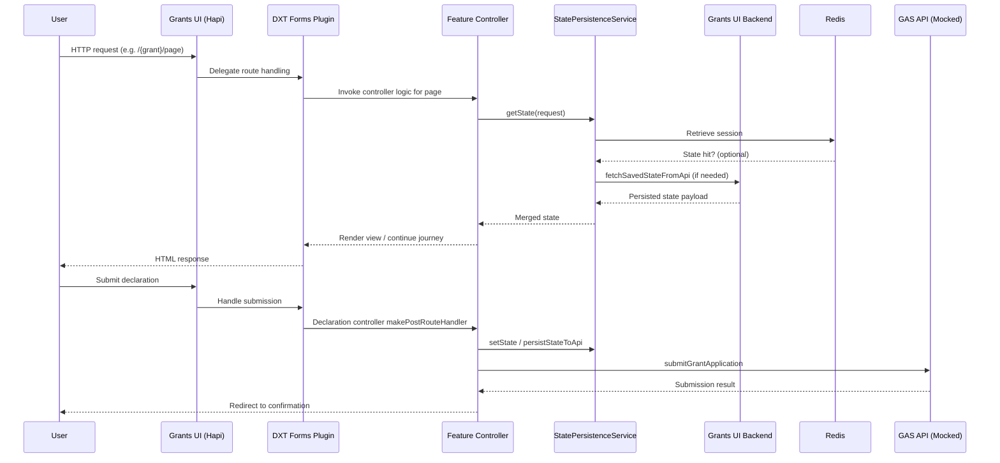
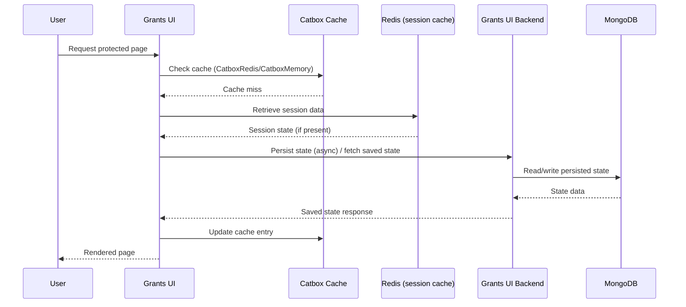
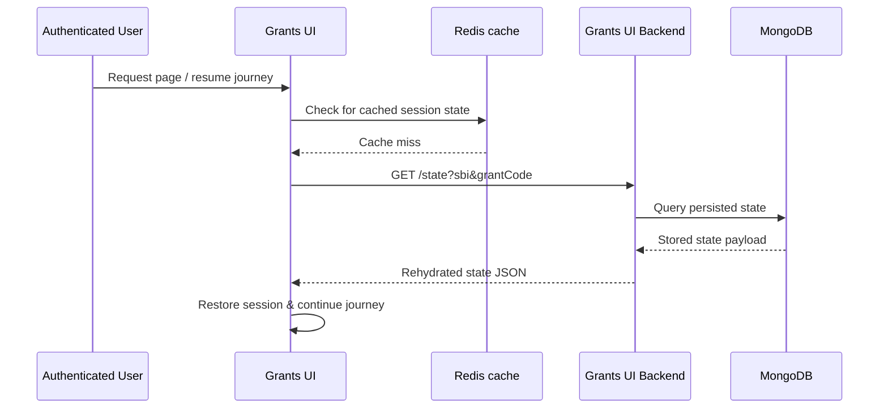
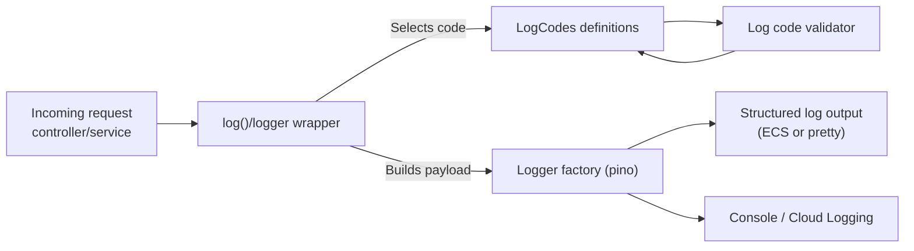

# grants-ui

[](https://sonarcloud.io/summary/new_code?id=DEFRA_grants-ui)
[](https://sonarcloud.io/summary/new_code?id=DEFRA_grants-ui)
[](https://sonarcloud.io/summary/new_code?id=DEFRA_grants-ui)

Core delivery platform Node.js Frontend Template.

- [Requirements](#requirements)
  - [Node.js](#nodejs)
- [DXT Forms Engine Plugin](#dxt-forms-engine-plugin)
- [Features](#features)
- [Development Tools & Configuration](#development-tools--configuration)
  - [Testing Framework](#testing-framework)
  - [Code Quality & Linting](#code-quality--linting)
  - [Authentication & Security](#authentication--security)
  - [Custom NPM Scripts](#custom-npm-scripts)
- [Cookies](#cookies)
  - [Inspecting cookies](#inspecting-cookies)
- [Server-side Caching](#server-side-caching)
- [Session Rehydration](#session-rehydration)
- [Land Grants API Authentication](#land-grants-api-authentication)
- [Redis](#redis)
- [Proxy](#proxy)
- [Feature Structure](#feature-structure)
- [Local Development](#local-development)
  - [Setup](#setup)
  - [Development](#development)
  - [Environment variables](#environment-variables)
  - [GAS Integration](#gas-integration)
  - [Production](#production)
  - [Npm scripts](#npm-scripts)
  - [Update dependencies](#update-dependencies)
  - [Formatting](#formatting)
    - [Windows prettier issue](#windows-prettier-issue)
- [Docker](#docker)
  - [Development image](#development-image)
  - [Production image](#production-image)
  - [Docker Compose](#docker-compose)
  - [Dependabot](#dependabot)
  - [SonarCloud](#sonarcloud)
- [Structured Logging System](#structured-logging-system)
  - [Core Components](#core-components)
  - [Directory Structure](#directory-structure)
  - [Log Code Categories](#log-code-categories)
  - [Usage Examples](#usage-examples)
  - [Log Code Structure](#log-code-structure)
  - [Configuration](#configuration)
  - [Best Practices](#best-practices)
  - [Integration Points](#integration-points)
  - [Testing](#testing)
  - [Monitoring and Observability](#monitoring-and-observability)
  - [Migration from Manual Logging](#migration-from-manual-logging)
  - [Adding New Log Codes](#adding-new-log-codes)
  - [Development Workflow](#development-workflow)
- [Analytics](#analytics)
- [Licence](#licence)
  - [About the licence](#about-the-licence)

## Requirements

### Node.js

Please install [Node.js](http://nodejs.org/) `>= v24` and [npm](https://nodejs.org/) `>= v9`. You will find it
easier to use the Node Version Manager [nvm](https://github.com/creationix/nvm)

To use the correct version of Node.js for this application, via nvm:

```bash
cd grants-ui
nvm use
```

## Features

The Grants UI service provides a comprehensive set of features for building grant application forms. These features are demonstrated in the Example Grant with Auth journey and documented in detail in [FEATURES.md](./FEATURES.md).

Key features include:

- **Form Components**: 13 different input components (TextField, RadiosField, CheckboxesField, etc.)
- **Page Types**: Summary, Declaration, Confirmation, Terminal, and Conditional pages
- **Guidance Components**: Html, Details, InsetText, Markdown, and List components
- **Authentication**: Defra ID integration with whitelist support
- **Conditional Logic**: Dynamic page routing and content display
- **Validation**: Custom validation messages and schema validation
- **Configuration**: YAML-based form definitions with confirmation content

For complete documentation of all available features, see [FEATURES.md](./FEATURES.md).

## DXT Forms Engine Plugin

Grants UI uses the [DXT Forms Engine](https://github.com/DEFRA/dxt-forms-engine) to render forms.

We override the default DXT SummaryPageController which is used as a combined "check answers" and "submit" page, to provide these as separate pages.

CheckResponsesPageController renders a page showing the questions and answers the user has completed, and allows the user to change their answers.

DeclarationPageController renders a declaration page and submits the form to GAS. It does not use the `confirmationState` used by DXT and does not clear the state.
Instead it sets `applicationStatus` to `SUBMITTED` along with `submittedAt` and `submittedBy` fields.

### Forms Engine State Model

DXT Controllers pass a `context` object into every handler. Grants UI relies on two key properties:

- `context.state`: the full mutable state bag for the current journey. Grants UI stores intermediate answers, lookups, and UI scaffolding here (for example `context.state.applicantContactDetails`). Use the helper methods exposed by the base controllers—primarily `await this.setState(request, newState)` or `await this.mergeState(request, context.state, update)`—to persist changes so they flow through the cache layer (`QuestionPageController.setState`, `QuestionPageController.mergeState` in the forms engine plugin).
- `context.relevantState`: a projection produced by the forms engine that contains only the answers needed for submission. This is the source of truth used by declaration/confirmation controllers when building payloads for GAS (see `DeclarationPageController`).

StatePersistenceService persists both structures through Grants UI Backend + Redis so that state survives page refreshes and “save and return” flows. When working on new controllers, prefer `context.relevantState` for data you plan to submit, and use `context.state` for auxiliary UI data. Changes to either must be serialisable because the persistence layer stores them as JSON.

Practical usage tips:

- `await this.setState(request, { ...context.state, applicantContactDetails: updated })` completely replaces the stored state for the current journey.
- `await this.mergeState(request, context.state, { applicantContactDetails: updated })` applies a shallow merge when you only need to tweak a subset of keys.
- Never mutate `context.state` in place; always go through the helpers so that the new state is flushed through the cache service and persisted for save-and-return flows.



## Development Tools & Configuration

### Testing Framework

The application uses **Vitest** as its test framework with custom module aliases for mocking external dependencies like `@defra/forms-engine-plugin`.

### Code Quality & Linting

- **Neostandard**: Modern JavaScript/Node.js linting configuration that provides opinionated code quality rules
- **TSX**: Modern Node.js runtime used for development server (better ES module support)

### Authentication & Security

- **Defra ID Integration**: Primary authentication service using OpenID Connect (OIDC) protocol
  - For detailed environment variable configuration, see [DEFRA ID Integration](#defra-id-integration)
- **Whitelist System**: CRN (Customer Reference Number) and SBI (Single Business Identifier) whitelisting for specific grants:
  - `EXAMPLE_WHITELIST_CRNS`: Authorized CRNs for Example Grant journeys (used by the Example Whitelist form definition)
  - `EXAMPLE_WHITELIST_SBIS`: Authorized SBIs for Example Grant journeys (used by the Example Whitelist form definition)
  - For complete whitelist configuration, see [Feature Flags & Misc](#feature-flags--misc)

### Whitelist Functionality

Whitelisting restricts access to specific grant journeys based on Customer Reference Numbers (CRNs) and Single Business Identifiers (SBIs). Forms that require whitelisting declare the relevant environment variables in their YAML definition (see [`src/server/common/forms/definitions/example-whitelist.yaml`](./src/server/common/forms/definitions/example-whitelist.yaml)). At runtime, the whitelist service (`src/server/auth/services/whitelist.service.js`) reads the configured environment variables, normalises the values, and validates incoming CRN/SBI credentials. If a user’s identifiers are not present in the configured whitelist, the journey is terminated and the user is shown a terminal page.

### Development Services Integration (docker compose)

- **Grants UI Backend**: Separate Node.js service (`defradigital/grants-ui-backend`) for data persistence
- **MongoDB**: Document database used by the backend service for storing application data
- **FFC Grants Scoring**: External scoring service (`defradigital/ffc-grants-scoring`) for grant evaluation
- **MockServer**: API mocking service for development and testing with predefined expectations
- **Defra ID Stub**: Local OpenID Connect provider used to mimic Defra ID authentication flows
- **GAS API (Mocked)**: Grants Application Service endpoint stubbed by MockServer for submissions and confirmation flows

```mermaid
graph TD
  User[Browser / User] -->|HTTP :3000| UI[Grants UI]
  UI -->|Session data| Redis[(Redis)]
  UI -->|State API| Backend[Grants UI Backend]
  Backend -->|Persist/Fetch| Mongo[(MongoDB)]
  UI -->|Scoring request| Scoring[FFC Grants Scoring]
  UI -->|Grant submission| GAS[MockServer (GAS API)]
  UI -.->|OIDC flows| DefraID[Defra ID Stub]
```

For complete service configuration and setup, see [Docker Compose](#docker-compose) section.

### Custom NPM Scripts

Beyond the standard scripts, the application includes contract testing via `npm run test:contracts` using Vitest.

## Cookies

We use the `@hapi/cookie` plugin to manage user sessions and `@hapi/yar` to manage cache. The session cookie is encrypted and signed using a high-entropy password set via the `SESSION_COOKIE_PASSWORD` environment variable.

The table below outlines the data the cookies control.

<table>
  <thead>
    <tr>
      <th>Cookie Name</th>
      <th>YAR managed</th>
      <th>Cache name</th>
      <th>Segment</th>
    </tr>
  </thead>
  <tbody>
    <tr>
      <td>grants-ui-session-auth</td>
      <td>No</td>
      <td>session-auth</td>
      <td>auth</td>
    </tr>
    <tr>
      <td rowspan="3">grants-ui-session-cache</td>
      <td>No</td>
      <td rowspan="3">session-cache</td>
      <td>tasklist-section-data</td>
    </tr>
    <tr>
      <td rowspan="2">Yes</td>
      <td>state</td>
    </tr>
    <tr>
      <td>formSubmission</td>
    </tr>
  </tbody>
</table>

### Inspecting cookies

There is a tool provided `tools/unseal-cookie.js` that will decode and decrypt the cookies for inspection on the command line. You will need the appropriate cookie password.
To use the tool:

```bash
// With node directly
node ./tools/unseal-cookie.js '<cookie-string>' '<cookie-password>'

// With the NPM script
npm run unseal-cookie -- '<cookie-string>' '<cookie-password>'
```

## Server-side Caching

We use Catbox for server-side caching. By default the service will use CatboxRedis when deployed and CatboxMemory for
local development.
You can override the default behaviour by setting the `SESSION_CACHE_ENGINE` environment variable to either `redis` or
`memory`.

Please note: CatboxMemory (`memory`) is _not_ suitable for production use! The cache will not be shared between each
instance of the service and it will not persist between restarts.



## Session Rehydration

The application includes session rehydration functionality that allows user sessions to be restored from a backend API. This is particularly useful for maintaining user state across different services.

### How Session Rehydration Works

The application fetches saved state from the backend API using the endpoint configured in `GRANTS_UI_BACKEND_URL`.
When a user is authenticated, the service:

- Checks for existing cache
- If there is none, fetches data from the Grants UI Backend service (which persists data to Mongo)
- Performs session rehydration



### Configuration

Session rehydration is controlled by the following environment variables:

- `GRANTS_UI_BACKEND_URL`: The Grants UI Backend service endpoint used for state persistence
- `GRANTS_UI_BACKEND_AUTH_TOKEN`: Bearer token used to authenticate requests to the backend
- `GRANTS_UI_BACKEND_ENCRYPTION_KEY`: Encryption key used to secure the backend bearer token

### Error Handling

If session rehydration fails (e.g., backend unavailable, network issues), the application will:

- Log the error for debugging
- Continue normal operation without restored state
- Allow the user to proceed with a fresh session

## Land Grants Api Authentication

The application now supports **server-to-server (S2S) authentication** when communicating with the **Land Grants API**.

When any request is made to the Land Grants API (e.g., `/payments/calculate`, `/parcels`), the system automatically includes an encrypted Bearer token in the `Authorization` header. This ensures secure, authenticated communication between services.

### How it works

1. The helper reads the following environment variables:
   - `LAND_GRANTS_API_AUTH_TOKEN` — static bearer token used for authentication.
   - `LAND_GRANTS_API_ENCRYPTION_KEY` — symmetric key used to encrypt the token.

2. The token is encrypted using **AES-256-GCM** before transmission.

3. The resulting value is encoded and set as the Bearer token in the `Authorization` header.

4. API clients like `land-grants.client.js` automatically include these headers in every request using:

   ```javascript
   import { createApiHeadersForLandGrantsBackend } from '~/src/server/common/helpers/state/backend-auth-helper.js'

   const response = await fetch(`${baseUrl}/payments/calculate`, {
     method: 'POST',
     headers: createApiHeadersForLandGrantsBackend(),
     body: JSON.stringify(payload)
   })
   ```

### Example Authorization Header

```
Authorization: Bearer <base64-encoded-encrypted-token>
Content-Type: application/json
```

### Environment Variables

| Variable                         | Description                                               |
| -------------------------------- | --------------------------------------------------------- |
| `LAND_GRANTS_API_AUTH_TOKEN`     | Bearer token used to authenticate to the Land Grants API. |
| `LAND_GRANTS_API_ENCRYPTION_KEY` | Key used to encrypt the auth token before transmission.   |

This mechanism provides a secure, environment-driven way to authenticate backend-to-backend requests without exposing plain-text tokens in configuration or logs.

## Redis

Redis is an in-memory key-value store. Every instance of a service has access to the same Redis key-value store similar
to how services might have a database (or MongoDB). All frontend services are given access to a namespaced prefixed that
matches the service name. e.g. `my-service` will have access to everything in Redis that is prefixed with `my-service`.

If your service does not require a session cache to be shared between instances or if you don't require Redis, you can
disable setting `SESSION_CACHE_ENGINE=false` or changing the default value in `~/src/config/index.js`.

## Proxy

A forward-proxy can be enabled by setting the `HTTP_PROXY` environment variable. When present, `setGlobalDispatcher(new ProxyAgent(proxyUrl))` is invoked automatically so calls made with `fetch` from `undici` use the proxy.

If you are not using Wreck, Axios or Undici or a similar http that uses `Request`. Then you may have to provide the proxy dispatcher:

To add the dispatcher to your own client:

```javascript
import { ProxyAgent } from 'undici'

return await fetch(url, {
  dispatcher: new ProxyAgent({
    uri: proxyUrl,
    keepAliveTimeout: 10,
    keepAliveMaxTimeout: 10
  })
})
```

## Feature Structure

The repository has been structured to follow a feature-based structure, where each feature is organized into its own directory with all related components (controllers, views, tests, and utilities).

### Feature Organization

Each feature follows a consistent structure:

```
src/server/{feature-name}/
├── {feature-name}.controller.js          # Main controller logic
├── {feature-name}.controller.test.js     # Controller tests
├── views/                                # Feature-specific views/templates
│   └── {feature-page}.html/.njk
├── index.js                              # Feature entry point (if needed)
└── {additional-utilities}.js             # Feature-specific utilities
```

#### Optional Subfolder Organization

For more complex features, additional subfolders can be used to further organize the code:

```
src/server/{feature-name}/
├── controllers/                          # Multiple controllers for different pages
│   ├── page1.controller.js
│   ├── page1.controller.test.js
│   ├── page2.controller.js
│   └── page2.controller.test.js
├── services/                             # Business logic and external service calls
│   ├── {feature-name}.service.js
│   └── {feature-name}.service.test.js
├── mappers/                              # Data transformation utilities
│   ├── state-to-gas-answers-mapper.js
│   └── state-to-gas-answers-mapper.test.js
├── utils/                                # Feature-specific utility functions
│   ├── format-phone.js
│   └── format-phone.test.js
├── views/                                # Feature-specific views/templates
│   └── {feature-page}.html/.njk
└── index.js                              # Feature entry point
```

This subfolder approach is particularly useful for features with multiple pages, complex business logic, or extensive data transformation requirements.

### Benefits of Feature-Based Structure

- **Co-location**: Related files are grouped together, making it easier to find and modify feature-specific code
- **Maintainability**: Clear separation of concerns with each feature self-contained
- **Scalability**: New features can be added following the same pattern
- **Testing**: Feature-specific tests are located alongside the code they test
- **Navigation**: Developers can quickly understand the structure and locate relevant files

## Local Development

### Setup

Install application dependencies:

```bash
npm install
```

### Development

To run the application in `development` mode run:

```bash
npm run dev
```

Or see the [docker compose setup](#docker-compose) below.

### Environment variables

Below is a list of required environment variables to configure and run the Grants UI application locally or in an environment (e.g., Dev, Test, Perf Test, Prod).

#### DEFRA ID Integration

These are required only if DEFRA ID authentication is enabled, and you are using either the FCP Defra ID Stub or connecting to Defra ID in the `development` environment:

| Variable                         | Description                                                                              |
| -------------------------------- | ---------------------------------------------------------------------------------------- |
| `DEFRA_ID_WELL_KNOWN_URL`        | The OIDC discovery URL used by DEFRA ID (must be reachable at startup).                  |
| `DEFRA_ID_CLIENT_ID`             | Provided by DEFRA ID — used to identify the app.                                         |
| `DEFRA_ID_CLIENT_SECRET`         | Secret from DEFRA ID — **must be kept confidential**.                                    |
| `DEFRA_ID_SERVICE_ID`            | Used by DEFRA ID to display your service name on the login screen.                       |
| `DEFRA_ID_REDIRECT_URL`          | URL DEFRA ID redirects to after login. **Must match exactly what DEFRA ID has on file.** |
| `DEFRA_ID_SIGN_OUT_REDIRECT_URL` | Redirect after logout. Same note as above.                                               |

#### Session and Cookie security

| Variable                  | Description                                                    | Default |
| ------------------------- | -------------------------------------------------------------- | ------- |
| `SESSION_COOKIE_PASSWORD` | High-entropy password (e.g., 32+ chars) for cookie encryption. |
| `SESSION_COOKIE_TTL`      | Cookie duration in milliseconds.                               |
| `SESSION_TIMEOUT`         | Inactivity timeout before logout.                              |
| `SESSION_CACHE_TTL`       | TTL for session data in the cache.                             |
| `SESSION_CACHE_ENGINE`    | Session store engine — `memory` or `redis`.                    |

#### Application URLs

| Variable                | Description                                    |
| ----------------------- | ---------------------------------------------- |
| `APP_BASE_URL`          | Base URL of the Grants UI app.                 |
| `GRANTS_UI_BACKEND_URL` | Local or remote backend endpoint.              |
| `GAS_API_URL`           | Endpoint for Grants Application Service (GAS). |
| `MANAGER_URL`           | Used for internal routing or redirects.        |
| `DESIGNER_URL`          | Form designer UI base URL.                     |
| `SUBMISSION_URL`        | Backend submission URL (Docker-safe format).   |
| `UPLOADER_URL`          | File uploader service endpoint.                |
| `UPLOADER_BUCKET_NAME`  | Name of the S3 or storage bucket.              |

#### GOV.UK Notify

| Variable             | Description                                           |
| -------------------- | ----------------------------------------------------- |
| `NOTIFY_TEMPLATE_ID` | ID of the Notify template used for user-facing comms. |
| `NOTIFY_API_KEY`     | GOV.UK Notify API key — **treat as a secret**.        |

#### Redis Configuration

| Variable           | Description                              |
| ------------------ | ---------------------------------------- |
| `REDIS_HOST`       | Redis host (e.g., `localhost` or Docker) |
| `REDIS_USERNAME`   | Username for Redis, if using ACL.        |
| `REDIS_PASSWORD`   | Password for Redis connection.           |
| `REDIS_KEY_PREFIX` | Prefix for all Redis keys used.          |

#### Feature Flags & Misc

| Variable           | Description                                          |
| ------------------ | ---------------------------------------------------- |
| `DEFRA_ID_ENABLED` | Enables defraId auth, and hides the SBI selector UI. |
| `FEEDBACK_LINK`    | URL to feedback (e.g., GitHub issue, form).          |

### Grant Form Definitions

Grant form definitions are stored in the `src/server/common/forms/definitions` directory as YAML files and read at startup.

Forms will not be enabled in production unless the YAML file contains the `enabledInProd: true` property.

Any changes to these files will require a restart of the application.

### GAS Integration

The Grants Application Service (GAS) is used to store grant definitions that the app submits data against.

Creating a Grant Definition
A grant definition is created via the GAS backend by making a POST request to the /grants endpoint (see postman folder in the root of the project). This defines the structure and schema of the grant application payload, which the app will later submit.

You can also create a grant using the swagger link below.

https://fg-gas-backend.dev.cdp-int.defra.cloud/documentation#/

Example request:

```
curl --location --request POST 'https://fg-gas-backend.dev.cdp-int.defra.cloud/grants' \
--header 'Content-Type: application/json' \
--data-raw '{
  "code": "adding-value-v4",
  "questions": {
    "$schema": "https://json-schema.org/draft/2020-12/schema",
    "title": "GrantApplicationPayload",
    "type": "object",
    "properties": {
      "referenceNumber": { "type": "string" },
      "businessNature": { "type": "string" },
      "businessLegalStatus": { "type": "string" },
      "isInEngland": { "type": "boolean" },
      "planningPermissionStatus": { "type": "string" },
      "projectStartStatus": { "type": "string" },
      "isLandBusinessOwned": { "type": "boolean" },
      "hasFiveYearTenancyAgreement": { "type": "boolean" },
      "isBuildingSmallerAbattoir": { "type": "boolean" },
      "isBuildingFruitStorage": { "type": "boolean" },
      "isProvidingServicesToOtherFarmers": { "type": "boolean" },
      "eligibleItemsNeeded": {
        "type": "array",
        "items": { "type": "string" }
      },
      "needsStorageFacilities": { "type": "string" },
      "estimatedCost": { "type": "number" },
      "canPayRemainingCosts": { "type": "boolean" },
      "processedProduceType": { "type": "string" },
      "valueAdditionMethod": { "type": "string" },
      "impactType": {
        "type": "array",
        "items": { "type": "string" }
      },
      "hasMechanisationUsage": { "type": "boolean" },
      "manualLabourEquivalence": { "type": "string" },
      "grantApplicantType": { "type": "string" },
      "agentFirstName": { "type": "string" },
      "agentLastName": { "type": "string" },
      "agentBusinessName": { "type": "string" },
      "agentEmail": { "type": "string", "format": "email" },
      "agentEmailConfirmation": { "type": "string", "format": "email" },
      "agentMobile": { "type": "string" },
      "agentLandline": { "type": "string" },
      "agentBusinessAddress__addressLine1": { "type": "string" },
      "agentBusinessAddress__addressLine2": { "type": ["string", "null"] },
      "agentBusinessAddress__town": { "type": "string" },
      "agentBusinessAddress__county": { "type": ["string", "null"] },
      "agentBusinessAddress__postcode": { "type": "string" },
      "applicantFirstName": { "type": "string" },
      "applicantLastName": { "type": "string" },
      "applicantEmail": { "type": "string", "format": "email" },
      "applicantEmailConfirmation": { "type": "string", "format": "email" },
      "applicantMobile": { "type": "string" },
      "applicantLandline": { "type": "string" },
      "applicantBusinessAddress__addressLine1": { "type": "string" },
      "applicantBusinessAddress__addressLine2": { "type": ["string", "null"] },
      "applicantBusinessAddress__town": { "type": "string" }
      // ... more fields if needed
    }
  }
}'
```

Example response:

```
{
    "code": "adding-value-v4"
}
```

#### Submission Schema Validators

Each GAS grant also has an associated schema stored locally in:

`src/server/common/forms/schemas/`

Each file should be named with the grant code (e.g., adding-value-v4.json) and contain the JSON Schema that validates the application payload for that grant.

At application startup, the app scans the schemas directory and compiles each schema into a JSON Schema validator using Ajv. These validators are cached in memory in a map of the form:

`Map<string, ValidateFunction>`

This map is used at runtime to validate payloads prior to submission using:

`validateSubmissionAnswers(payload, grantCode)`

This ensures each grant submission matches the expected schema defined in GAS and prevents invalid data from being submitted.

#### Grant Schema Updates

In order to update a grant schema, visit:

- https://fg-gas-backend.dev.cdp-int.defra.cloud/documentation#/

Find the endpoint `GET /grants/{code}`, pass in the code, e.g. `frps-private-beta`, will return the grant.

When changes have been made to the schema, use the endpoint `PUT /tmp/grants/{code}` to update the grant schema.

In order to test if your schema change has worked, send through an application, and view the case tool, to see if your new data exists in the case:

https://fg-cw-frontend.dev.cdp-int.defra.cloud/cases

From here you can find the `caseId`, use the below swagger to query the `GET /cases/{caseId}`

https://fg-cw-backend.dev.cdp-int.defra.cloud/documentation#/

### Production

To mimic the application running in `production` mode locally run:

```bash
npm start
```

### Npm scripts

All available Npm scripts can be seen in [package.json](./package.json)
To view them in your command line run:

```bash
npm run
```

#### Available Scripts

- **`build`** - Build both frontend and server for production
- **`build:frontend`** - Build frontend assets with webpack for production
- **`build:server`** - Transpile server code with Babel for production
- **`dev`** - Start development environment with frontend and server watch mode
- **`dev:debug`** - Start development environment with debug mode enabled
- **`docker:dev`** - Start development environment using Docker Compose
- **`docker:dev:rebuild`** - Rebuild and restart Docker development environment
- **`format`** - Format code using Prettier
- **`format:check`** - Check code formatting without making changes
- **`lint`** - Run all linting checks (JavaScript, SCSS, TypeScript)
- **`lint:fix`** - Automatically fix linting issues where possible
- **`test`** - Run test suite with coverage
- **`test:watch`** - Run tests in watch mode
- **`start`** - Start production server (requires build first)
- **`snyk-test`** - Run Snyk security vulnerability tests
- **`snyk-monitor`** - Monitor project with Snyk

### Update dependencies

To update dependencies use [npm-check-updates](https://github.com/raineorshine/npm-check-updates):

> The following script is a good start. Check out all the options on
> the [npm-check-updates](https://github.com/raineorshine/npm-check-updates)

```bash
ncu --interactive --format group
```

### Formatting

#### Windows prettier issue

If you are having issues with formatting of line breaks on Windows update your global git config by running:

```bash
git config --global core.autocrlf false
```

## Docker

### Development image

Build:

```bash
docker build --target development --no-cache --tag grants-ui:development .
```

Run:

```bash
docker run -p 3000:3000 grants-ui:development
```

### Production image

Build:

```bash
docker build --no-cache --tag grants-ui .
```

Run:

```bash
docker run -p 3000:3000 grants-ui
```

### Docker Compose

A local environment with:

- Redis
- MongoDB
- FCP Defra ID Stub
- This service
- Grants UI Backend
- MockServer, providing a stub for [fg-gas-backend](http://github.com/DEFRA/fg-gas-backend)

```bash
docker compose up --build -d
```

And optionally:

- Land Grants API and Postgres via `compose.land-grants.yml`

```bash
docker compose up -f compose.yml -f compose.land-grants.yml --build -d
```

Note: Running the Land Grants API and Postgres requires land data to be populated in the Land Grants Postgres database.
This must be done manually using the compose scripts in the [land-grants-api](http://github.com/DEFRA/land-grants-api) repository
and only needs to be done once, unless you need to clear and re-seed the database, or if you remove the `postgres_data` volume.

Once that repository is cloned locally, `compose.migrations.yml` provides `database-up` and `database-down` services to run migrations against the Postgres database.

Convenient npm scripts have been added in that repository for this workflow:

```bash
# Apply migrations to the grants-ui database
npm run docker:db:migrate:up

# Roll back all migrations to the base tag v0.0.0
npm run docker:db:migrate:down
```

#### High-availability (HA) local proxy

For local testing behind HTTPS and to simulate an HA entry point, there is an optional Nginx reverse proxy defined in `compose.ha.yml`.

What it provides:

- Scalability of `grants-ui` and `grants-ui-backend` using `docker compose --scale`
- TLS termination using the self-signed certs in `nginx/certs`
- A single HTTPS entry point for the UI at `https://localhost:4000`
- HTTPS access to the DEFRA ID Stub at `https://localhost:4007`
- Environment overrides so the UI talks to the proxy over HTTPS (see `compose.ha.yml` and `nginx/nginx.conf`)

Start the stack with the HA proxy:

```bash
docker compose -f compose.yml -f compose.ha.yml up -d --build --scale grants-ui=2 --scale grants-ui-backend=2
```

Stop the HA stack:

```bash
docker compose -f compose.yml -f compose.ha.yml down
```

You can also run the HA stack with the Land Grants API and Postgres via npm scripts:

Start the stack with Land Grants API and the HA proxy:

```bash
npm run docker:landgrants:ha:up
```

Stop the HA stack:

```bash
npm run docker:landgrants:ha:down
```

Notes:

- The proxy container is `grants-ui-proxy` and uses `nginx/nginx.conf`.
- Certificates are mounted from `nginx/certs` (`nginx.crt` and `nginx.key`). Your browser may require trusting the cert the first time you visit `https://localhost:4000`.
- The UI container is configured with `NODE_EXTRA_CA_CERTS=/etc/ssl/certs/nginx.crt` so it trusts the proxy's certificate when calling internal HTTPS endpoints.

**Authorise Snyk**

Run `snyk auth` to authenticate your local machine with Snyk.

### Dependabot

We have added an example dependabot configuration file to the repository. You can enable it by renaming
the [.github/example.dependabot.yml](.github/example.dependabot.yml) to `.github/dependabot.yml`

### SonarCloud

Instructions for setting up SonarCloud can be found in [sonar-project.properties](./sonar-project.properties).

## Structured Logging System

The application implements a comprehensive structured logging system providing consistent, searchable, and maintainable logging across all components.

### Core Components

- **Logger**: Pino-based logger with ECS format support
- **Log Codes**: Structured, hierarchical log definitions
- **Validation**: Runtime validation of log code definitions
- **Tracing**: Distributed tracing with request correlation



### Directory Structure

```
src/server/common/helpers/logging/
├── logger-options.js      # Logger configuration
├── request-logger.js      # Hapi request logger plugin
├── log.js                 # Structured logging wrapper
├── log-codes.js           # Structured log definitions
├── log-code-validator.js  # Log code validation
└── *.test.js             # Test files
```

### Log Code Categories

The system organizes log codes into logical categories:

- **AUTH**: Authentication and authorization events
- **FORMS**: Form processing and validation
- **SUBMISSION**: Grant submission lifecycle
- **DECLARATION**: Declaration page processing
- **CONFIRMATION**: Confirmation page processing
- **TASKLIST**: Task list management
- **LAND_GRANTS**: Land grant specific functionality
- **AGREEMENTS**: Agreement processing
- **SYSTEM**: System-level events and errors

### Usage Examples

#### Basic Structured Logging

```javascript
import { log, LogCodes } from '~/src/server/common/helpers/logging/log.js'

// Log successful authentication
log(LogCodes.AUTH.SIGN_IN_SUCCESS, {
  userId: 'user123',
  organisationId: 'org456'
})

// Log form submission
log(LogCodes.SUBMISSION.SUBMISSION_SUCCESS, {
  grantType: 'adding-value',
  referenceNumber: 'REF123456'
})

// Log validation error
log(LogCodes.FORMS.FORM_VALIDATION_ERROR, {
  formName: 'declaration',
  error: 'Required field missing'
})
```

#### Direct Logger Access

```javascript
import { logger } from '~/src/server/common/helpers/logging/log.js'

// For simple logging when structured codes aren't needed
logger.info('Simple info message')
logger.error(error, 'Error with context')
```

### Log Code Structure

Each log code must have two required properties:

```javascript
{
  level: 'info' | 'debug' | 'error',
  messageFunc: (messageOptions) => string
}
```

Example log code definition:

```javascript
AUTH: {
  SIGN_IN_SUCCESS: {
    level: 'info',
    messageFunc: (messageOptions) =>
      `User sign-in successful for user=${messageOptions.userId}, organisation=${messageOptions.organisationId}`
  }
}
```

### Configuration

Logging is configured via environment variables:

- `LOG_ENABLED`: Enable/disable logging (default: enabled except in test)
- `LOG_LEVEL`: Log level (debug, info, warn, error, etc.)
- `LOG_FORMAT`: Output format (ecs for production, pino-pretty for development)

#### Log Verbosity Control

The application automatically adjusts log verbosity based on the `LOG_LEVEL` setting:

**INFO Level (Default)**

- Simplified, readable request/response logs
- Excludes verbose details like headers, cookies, and query parameters
- Shows essential information: method, URL, status code, and response time
- Example: `[response] GET /adding-value/start 200 (384ms)`

**DEBUG Level (Development)**

- Full detailed request/response logs
- Includes all headers, cookies, query parameters, and request body
- Useful for troubleshooting and deep debugging
- Shows external API calls with full context

To enable debug logging:

```bash
# In Docker Compose
LOG_LEVEL=debug docker compose up

# Or set in .env file
LOG_LEVEL=debug

# Or set in compose.yml environment variables
LOG_LEVEL: debug
```

**Note**: When changing `LOG_LEVEL` in `compose.yml`, restart the container:

```bash
docker compose restart grants-ui
# or
docker compose up -d --force-recreate grants-ui
```

### Best Practices

1. **Use Structured Logging**: Prefer log codes over direct logger calls
2. **Include Context**: Always include relevant identifiers (userId, grantType, etc.)
3. **Consistent Naming**: Use consistent parameter names across log codes
4. **Error Handling**: Log errors with sufficient context for debugging
5. **Performance**: Use debug level for detailed logs that may impact performance
6. **Security**: Never log sensitive information (passwords, tokens, etc.)

### Integration Points

The structured logging system is integrated throughout the application:

- **Authentication**: All auth events (sign-in, sign-out, token verification)
- **Form Processing**: Load, submission, validation events
- **Controllers**: Declaration, confirmation, and other page controllers
- **Error Handling**: Global error handler with structured error logging
- **Services**: Form services, submission services, and external API calls

### Testing

All logging components include comprehensive test coverage:

- **Unit Tests**: Test individual log codes and validation
- **Integration Tests**: Test logging in request/response cycles
- **Mock Testing**: Mock logger for testing without actual log output

### Acceptance Testing

Acceptance Tests for the grants-ui platform will be developed by multiple teams for their own grant journeys, each creating their own journey test suite in CDP. These test suites are run as images in the grants-ui CI against a containerised system which includes the frontend, backend, scoring service, Redis and Mongo, with stubs for Defra ID and GAS.

#### Compose files

There is an override file `compose.ci.yml` which is used when running acceptance tests. This stands the system up at `https://grants-ui-proxy:4000` and the tests are then run in their own containers on the same Docker network.

#### Changes to Journey Test Repositories

To support this concept journey test repositories must:

- Publish an image to Docker Hub as per the services
- Allow a command to be passed to the entrypoint script
- Support an npm `run test:ci` option

See `grants-ui-acceptance-tests` for an example.

#### Running Acceptance Tests locally

To run the full set of acceptance tests locally the developer can run script `./tools/run-acceptance-tests.sh`. Each acceptance test suite will have a compose file in `/acceptance` and a call in `run-acceptance-tests.sh`, and will be run sequentially against the containerised system.

#### Running individual Acceptance Tests

It is possible to run acceptance tests at individual feature file level by passing the path to the feature file in the test container to `run-acceptance-tests.sh`. For example:

```bash
./tools/run-acceptance-tests.sh ./test/features/example-whitelist/whitelist.feature
```

#### Parallel Test Execution

The acceptance tests support parallel execution through the `SE_NODE_MAX_SESSIONS` environment variable, which controls the Selenium node's maximum concurrent sessions. The default value is 2 sessions.

**Configuration:**

The `SE_NODE_MAX_SESSIONS` variable can be set in your `.env` file:

```bash
# Default value is 2
SE_NODE_MAX_SESSIONS=2

# To run with more parallelization
SE_NODE_MAX_SESSIONS=4
```

**Running Tests with SE_NODE_MAX_SESSIONS:**

You can also set the `SE_NODE_MAX_SESSIONS` environment variable directly when running acceptance tests:

```bash
# Run all acceptance tests with 4 parallel sessions
SE_NODE_MAX_SESSIONS=4 ./tools/run-acceptance-tests.sh
```

**Note:** A higher value may not reduce test execution time beyond a certain point and can introduce more instability into your Selenium node. Beyond this approach a Selenium grid of hub and multiple nodes becomes necessary, but which testing shows uses much more resource for only small gains in our usage.

#### CI

The `run-acceptance-tests.sh` script is run as part of the GitHub PR workflow for grants-ui.

### Monitoring and Observability

The structured logging system supports:

- **ECS Format**: Elasticsearch Common Schema for log aggregation
- **Distributed Tracing**: Request correlation across service boundaries
- **Log Aggregation**: Searchable logs with consistent structure
- **Alerting**: Structured data enables automated alerting on specific events

### Migration from Manual Logging

When updating existing code:

1. Replace `request.logger.info()` with structured log codes
2. Replace `logger.error()` with appropriate error log codes
3. Add relevant context parameters (userId, grantType, etc.)
4. Use appropriate log levels (info, debug, error)
5. Test that logging works correctly in different environments

### Adding New Log Codes

To add new log codes:

1. **Define the log code** in `log-codes.js` with proper structure
2. **Add to appropriate category** or create new category if needed
3. **Include both level and messageFunc** properties
4. **Write comprehensive tests** in the corresponding test file
5. **Update documentation** if introducing new patterns

Example:

```javascript
FORMS: {
  FORM_CACHE_ERROR: {
    level: 'error',
    messageFunc: (messageOptions) =>
      `Form cache error for ${messageOptions.formName}: ${messageOptions.error}`
  }
}
```

### Development Workflow

1. **Use existing log codes** when possible
2. **Create new log codes** when needed following established patterns
3. **Test thoroughly** including edge cases and error scenarios
4. **Document changes** in code comments and this guide
5. **Review logs** in development to ensure proper formatting

This structured logging system provides a robust foundation for monitoring, debugging, and maintaining the Grants UI application with consistent, searchable, and actionable logging throughout the system.

## Config-Driven Confirmation Pages

The application supports config-driven confirmation pages that allow forms to define custom confirmation content through YAML configuration. This provides a flexible way to create tailored confirmation experiences for different grants without code changes.

### What you can add

- Custom HTML content with GOV.UK Design System components
- Reusable template components through placeholders
- Dynamic content insertion using session data (reference numbers, business details, etc.)

### How to Use Config Confirmations

#### Define Confirmation Content in Form YAML

Please see journeys for examples

#### Route Configuration

The config confirmation system automatically handles routes matching `/{slug}/confirmation` for any form that has `confirmationContent` defined in its YAML configuration.

### Reusable Template Components

The system includes a components registry that allows you to define reusable HTML snippets that can be inserted into confirmation content using placeholders.

#### Available Components

- `{{DEFRASUPPORTDETAILS}}` - Renders contact information and support details for DEFRA

Simply include the placeholder in your confirmation content HTML:

```yaml
confirmationContent:
  html: |
    <h2 class="govuk-heading-m">Application submitted</h2>
    <p class="govuk-body">Your reference number is: <strong>{{referenceNumber}}</strong></p>

    {{DEFRASUPPORTDETAILS}}
```

#### Adding New Reusable Components

Register new components in `src/server/confirmation/services/components.registry.js`:

```javascript
ComponentsRegistry.register(
  'myComponent',
  `<div class="govuk-inset-text">
    <p>This is a reusable component</p>
  </div>`
)
```

Then use it in your YAML with `{{MYCOMPONENT}}` (uppercase).

### Development Tools for Confirmation Pages

The application includes dev tools to help test and preview confirmation pages during development.

#### Demo Confirmation Route

Access demo confirmation pages at: `http://localhost:3000/dev/demo-confirmation/{form-slug}`

When running in development mode, the demo confirmation handler:

- Shows warning messages when no confirmation config is found
- Provides fallback demonstration content
- Displays form metadata (title, slug, ID) for debugging
- Includes error details when configuration issues occur
- Uses mock data for testing dynamic content insertion

## Analytics

For more information about analytics, see [Analytics](./docs/ANALYTICS.md).

## Licence

THIS INFORMATION IS LICENSED UNDER THE CONDITIONS OF THE OPEN GOVERNMENT LICENCE found at:

<http://www.nationalarchives.gov.uk/doc/open-government-licence/version/3>

The following attribution statement MUST be cited in your products and applications when using this information.

> Contains public sector information licensed under the Open Government license v3

### About the licence

The Open Government Licence (OGL) was developed by the Controller of Her Majesty's Stationery Office (HMSO) to enable
information providers in the public sector to license the use and re-use of their information under a common open
licence.

It is designed to encourage use and re-use of information freely and flexibly, with only a few conditions.
